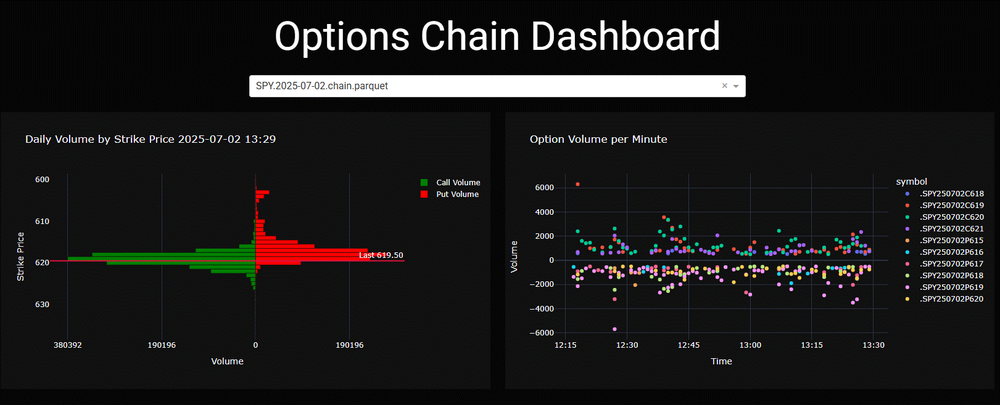
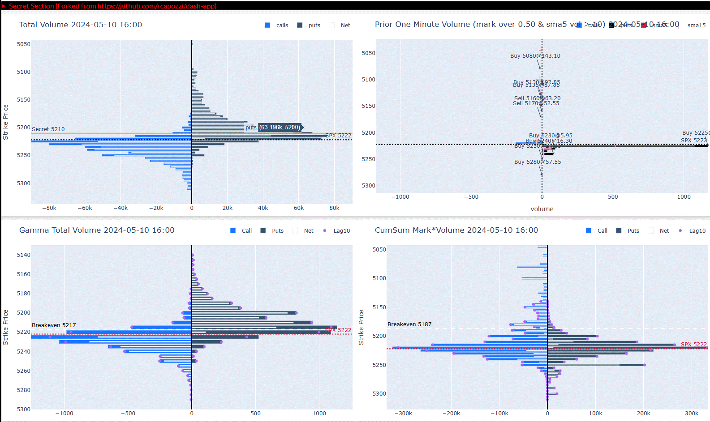

# Options Radar Zero

Real-time 0DTE option chain monitoring for SPX, SPY, and ES.



SPX:


## Prerequisites

- Python 3.14
- [uv](https://docs.astral.sh/uv/) for dependency management

## Setup

```bash
uv sync
```

## Tastytrade API Credentials

Create a `.env` file with Tastytrade OAuth credentials:

```ini
TT_REFRESH=your_refresh_token
TT_SECRET=your-client-secret
```

Get these from [Tastytrade's developer portal](https://api.developer.tastytrade.com).

## Running the Dashboard Server

```bash
# Local development (auto-reloads on code changes)
uv run python -m options_radar_zero.app
# Visits http://localhost:8053

# Or with gunicorn (production)
uv run gunicorn options_radar_zero.app:server -b :8050 --access-logfile access.log -D
```

## Running the Poller

The poller requires a YAML config file specifying symbols and strike distances:

```yaml
# poller_config.yaml
output_dir: ./output
symbols:
  - symbol: SPY
    strikes: 40
  - symbol: QQQ
    strikes: 40
  - symbol: SPX
    strikes: 30
  - symbol: ES
    strikes: 20
```

Start the poller:

```bash
# Using Makefile
make poller

# Or directly
uv run python -m options_radar_zero.poller.cli --config examples/poller_config.yaml

# Override output directory
uv run python -m options_radar_zero.poller.cli --config examples/poller_config.yaml --output-dir /custom/path

# End-of-day catch-up (fills gaps from live polling session)
uv run python -m options_radar_zero.poller.cli --config examples/poller_config.yaml --eod
```

A sample config is provided at `examples/poller_config.yaml`.

### How the Poller Works

1. **Market open**: Polls option chain market data every minute per symbol (aligned to the top of each minute), writing to `{symbol}.{YYYYMMDD}.chain.parquet`
2. **Pre-market (after 9am, before 9:30am)**: Automatically sleeps until 9:30 AM market open, then begins polling
3. **Market closed without `--eod`**: Exits quietly (no catch-up)
4. **Market closed with `--eod`**: Performs end-of-day catch-up — fetches fresh data and merges into existing parquet files using the **last trade date** as the filename

## Development

```bash
make lint      # ruff check
make typecheck # mypy
make test      # pytest with coverage
```

### Data Files

- Output: `{symbol}.{YYYYMMDD}.chain.parquet` in the configured `output_dir`
- Lock file: `.poller.lock` prevents duplicate poller instances

## Project Structure

| Module | Responsibility |
|--------|---------------|
| `app.py` | Thin Bootstrap |
| `app_factory.py` | `create_app()` Factory |
| `routes.py` | Flask Routes + Downloads |
| `callbacks.py` | Dash Callback Registration |
| `callback_state.py` | `ChartState` Dataclass |
| `layouts.py` | UI Component Factories |
| `visualization.py` | Plotly Chart Functions |
| `data_processing.py` | Pure Data Transformations |
| `thinkscript.py` | ThinkScript Template Rendering |
| `market_hours.py` | Market Hours + Intervals |
| `config.py` | `AppConfig` + Constants |
| `data_loader.py` | `DataLoader` Class |
| `utils.py` | Slimmed `OptionQuotes` |
| `tastytrade_api.py` | Tastytrade API Wrapper |
| `poller/` | 0DTE Data Poller CLI |

## CI

GitHub Actions runs `ruff`, `mypy`, and `pytest` (90% coverage threshold) on Python 3.11–3.14.
